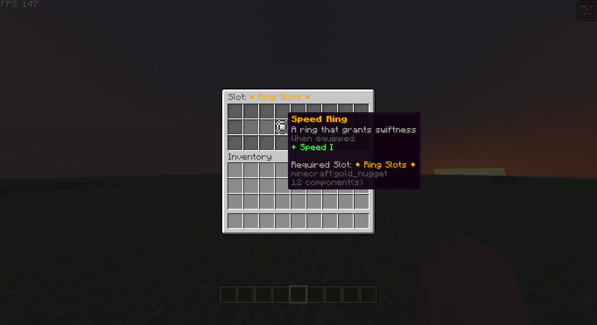

# Developer API – Accessory Items & Slot Types

This page explains how **accessory items** and **slot types** work together in CuriosPaper, and how to use the API (and patterns from **HeadBound**) to:

- Define what items count as accessories.
- Bind items to specific slot types (`head`, `back`, `ring`, etc.).
- Validate and inspect slot metadata safely.
- Build your own systems (effects, stats, passives) on top.

If you haven’t read **Quickstart** and **Configuration / Slots & GUI** yet, do that first.


---

## 1. Slot Types – The Core Concept

Every accessory in CuriosPaper is tied to a **slot type ID**, a `String` that matches a key under the `slots:` section of `config.yml`.

Example:

```yaml
slots:
  head:
    name: "&e⚜ Head Slot ⚜"
    icon: "GOLDEN_HELMET"
    item-model: "curiospaper:head_slot"
    amount: 1

  ring:
    name: "&6◆ Ring Slots ◆"
    icon: "GOLD_NUGGET"
    item-model: "curiospaper:ring_slot"
    amount: 2

  charm:
    name: "&d✧ Charm Slots ✧"
    icon: "EMERALD"
    item-model: "curiospaper:charm_slot"
    amount: 4
````

From the API perspective, what matters is:

* **Slot IDs:** `"head"`, `"ring"`, `"charm"`, …
* **Slot capacity:** `amount` = how many internal slots of that type each player has.

These IDs are what you pass into methods as `String slotType`.

---

## 2. Discovering Slot Types at Runtime

Don’t hardcode assumptions unless you want your addon to break on custom configs.

```java
List<String> slotTypes = curiosApi.getAllSlotTypes();

for (String type : slotTypes) {
    getLogger().info("Curios slot type: " + type
            + " (capacity: " + curiosApi.getSlotAmount(type) + ")");
}
```

Use this when:

* You want to support **any** server config.
* You’re writing generic systems like “add stats for every accessory in any slot”.

---

## 3. HeadBound-Style Item Definition (What You Should Copy)

HeadBound doesn’t create random `ItemStack`s all over the place.
It defines items in a single enum, then has a factory to build them.

**Pattern you should use too:**

```java
public enum MyAccessoryDef {

    SCOUTS_LENS(
            "scouts-lens",
            "§eScout's Lens",
            Material.GLASS,
            "Reveals nearby mobs while sneaking."
    ),

    MINERS_CHARMBAND(
            "miners-charmband",
            "§bMiner's Charmband",
            Material.BLACK_BANNER,
            "Gives night vision while underground."
    );

    private final String key;
    private final String displayName;
    private final Material baseMaterial;
    private final String description;

    MyAccessoryDef(String key, String displayName, Material baseMaterial, String description) {
        this.key = key;
        this.displayName = displayName;
        this.baseMaterial = baseMaterial;
        this.description = description;
    }

    public String getKey() { return key; }
    public String getDisplayName() { return displayName; }
    public Material getBaseMaterial() { return baseMaterial; }
    public String getDescription() { return description; }
}
```

Then a small factory, similar to HeadBound’s `ItemManager` / `ItemUtil`:

```java
public final class AccessoryItemFactory {

    private AccessoryItemFactory() {}

    public static ItemStack buildBaseItem(MyAccessoryDef def) {
        ItemStack stack = new ItemStack(def.getBaseMaterial());
        ItemMeta meta = stack.getItemMeta();

        meta.setDisplayName(def.getDisplayName());
        meta.setLore(List.of("§7" + def.getDescription()));
        // You can also set custom model data if you want, but CuriosPaper prefers item-model IDs.

        stack.setItemMeta(meta);
        return stack;
    }
}
```

This keeps definitions in one place and makes your code not a mess.

---

## 4. Tagging Items as Accessories

Tagging is where an item **becomes** a Curios accessory.

```java
ItemStack base = AccessoryItemFactory.buildBaseItem(MyAccessoryDef.SCOUTS_LENS);

// MUST match a key under `slots:` in config.yml
String slotType = "head";

ItemStack tagged = curiosApi.tagAccessoryItem(base, slotType, true);
```

Parameters:

* `base` – your base `ItemStack` (no Curios data yet).
* `slotType` – e.g. `"head"`, `"back"`, `"ring"`, `"charm"`, or a custom slot type from `config.yml`.
* `true` – whether to auto-add a “Required Slot” lore line (if that feature is enabled).

The returned item:

* Has Curios-specific metadata.
* Will only be treated as an accessory for that slot type.
* Will show up in Curios GUI and API queries.

**HeadBound pattern:**

* Builds items using its enum.
* Calls `tagAccessoryItem(item, "head", true)` when creating them.
* Never manually writes Curios metadata.

---

## 5. Inspecting the Slot Type from an Item

You can ask CuriosPaper which slot an item is for:

```java
String slotType = curiosApi.getAccessorySlotType(itemStack);

if (slotType != null) {
    player.sendMessage("§7This accessory is for slot: §e" + slotType);
} else {
    player.sendMessage("§cThis item is not a Curios accessory.");
}
```

That works for:

* Items from your addon.
* Items from other CuriosPaper-based plugins.

---

## 6. Validating Slot Types & Accessories

Don’t assume anything. Use the API.

### 6.1 Check if a slot type exists

```java
if (!curiosApi.isValidSlotType("ring")) {
    getLogger().warning("Ring slot not defined in Curios config. Disable ring-related features.");
}
```

### 6.2 Get slot capacity

```java
int ringSlots = curiosApi.getSlotAmount("ring"); // e.g. 2
int charmSlots = curiosApi.getSlotAmount("charm"); // e.g. 4
```

Use this to:

* Respect configured limits.
* Scale bonuses based on how many slots exist.

### 6.3 Validate an item for a given slot

```java
boolean validRingAccessory = curiosApi.isValidAccessory(itemStack, "ring");

if (!validRingAccessory) {
    player.sendMessage("§cThat item cannot be equipped in the ring slot.");
}
```

You should use this in:

* Custom GUIs (if you build your own).
* Commands that auto-equip stuff.
* Any system that manipulates equipment directly.

---

## 7. Recipes / Patterns

### 7.1 Starter Accessory (HeadBound-style)

This is the “give item → tagged → done” pattern used in HeadBound.

```java
public void giveStarterCharm(Player player, CuriosPaperAPI curiosApi) {
    ItemStack base = AccessoryItemFactory.buildBaseItem(MyAccessoryDef.MINERS_CHARMBAND);

    // Charm slot (must exist in config)
    ItemStack taggedCharm = curiosApi.tagAccessoryItem(base, "charm", true);

    player.getInventory().addItem(taggedCharm);
}
```

---

### 7.2 Restricting Accessories Beyond Slot Type

CuriosPaper enforces **“this item belongs to slot X”**.
If you want extra rules like “only certain rings are allowed in ring slot”, that’s on you.

Example: only allow items whose name begins with a prefix:

```java
private boolean isAllowedRing(ItemStack item) {
    if (item == null || !item.hasItemMeta()) return false;

    ItemMeta meta = item.getItemMeta();
    if (!meta.hasDisplayName()) return false;

    String name = meta.getDisplayName();
    return name.startsWith("§6Ring of ") || name.startsWith("§bAncient Band");
}
```

Use it with `AccessoryEquipEvent`:

```java
@EventHandler
public void onAccessoryEquip(AccessoryEquipEvent event) {
    if (!"ring".equalsIgnoreCase(event.getSlotType())) return;
    if (event.getNewItem() == null) return;

    if (!isAllowedRing(event.getNewItem())) {
        event.setCancelled(true);
        event.getPlayer().sendMessage("§cYou cannot equip that ring.");
    }
}
```

HeadBound does similar logic per-item: handlers check exactly which accessory was equipped and apply their own effects.

---

### 7.3 Bonuses Per Slot Type

You can build “slot-based” bonuses, not item-based.

Example: each **charm** gives +1 max health.

```java
public double getCharmHealthBonus(Player player, CuriosPaperAPI curiosApi) {
    List<ItemStack> charms = curiosApi.getEquippedItems(player, "charm");
    int count = charms.size();
    return count; // 1 heart per charm, or whatever your system uses
}
```

Then integrate this with your own stat system or attributes.
HeadBound does this conceptually (per-item, not per-slot) across its handlers.

---

### 7.4 Generic Accessory Summary (Config-Aware)

Let your addon auto-adapt to any slot configuration:

```java
public void sendAccessorySummary(Player player, CuriosPaperAPI curiosApi) {
    List<String> slotTypes = curiosApi.getAllSlotTypes();

    player.sendMessage("§8[§dCurios§8] §7Your accessories:");
    for (String slotType : slotTypes) {
        int count = curiosApi.countEquippedItems(player, slotType);
        if (count <= 0) continue;

        player.sendMessage("§f- §e" + slotType + "§7: " + count + " item(s)");
    }
}
```

You’re not hardcoding `"ring"`, `"charm"`, etc., so it doesn’t explode if the admin renames or removes stuff.

---

## 8. Accessory vs Normal Items (How CuriosPaper Decides)

CuriosPaper doesn’t care what an item **looks** like.
It only cares about the **metadata it wrote itself**.

An item is a Curios accessory if:

* You tagged it via `tagAccessoryItem`, or
* Another addon tagged it using the same API.

If it’s not tagged:

* It won’t be accepted by the Curios GUI.
* It won’t be stored in Curios save data.
* `getAccessorySlotType(item)` returns `null`.
* `isValidAccessory(item, slotType)` returns `false`.

Don’t try to fake it. You’ll just break things.

---

## 9. Anti-Patterns (Don’t Do This)

If you do any of this, your addon is asking for pain:

### ❌ Manually editing Curios metadata / NBT

You are not smarter than the plugin. Use:

* `tagAccessoryItem`
* `getAccessorySlotType`
* `isValidAccessory`

Anything else risks corrupt data or breaking future updates.

---

### ❌ Hardcoding slot assumptions

“Ring slot always exists and has 2 slots” – no.

Use:

* `isValidSlotType("ring")`
* `getSlotAmount("ring")`
* `getAllSlotTypes()`

Server owners **will** change these.

---

### ❌ Treating “item looks like a ring” as “this is a ring accessory”

Lore, display name, material – none of that makes it a Curios accessory.
Only the Curios metadata does.

Always validate:

```java
boolean valid = curiosApi.isValidAccessory(item, "ring");
```

---

## 10. Summary

* Slot types are **IDs from `slots:` in config.yml**.
* Accessories are **ItemStacks tagged via `tagAccessoryItem`**.
* Use the API to:

    * Discover slot types: `getAllSlotTypes()`
    * Check validity: `isValidSlotType`, `isValidAccessory`
    * Get capacity: `getSlotAmount`
    * Inspect items: `getAccessorySlotType`
* Follow the **HeadBound pattern**:

    * Central enum for item definitions
    * Factory to build items
    * Tag with CuriosPaper API
    * Use events + queries for behavior
