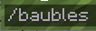
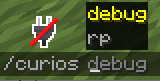
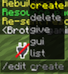

# Commands

CuriosPaper adds three commands to your server. All commands support tab completion.

CuriosPaper provides three main commands for players and administrators.

## Player Commands

### `/baubles`

Opens the accessory inventory GUI.

| | |
|---|---|
| **Aliases** | `/b`, `/bbag` |
| **Permission** | None (all players) |
| **Usage** | `/baubles` |
| **Player Only** | Yes |

## Admin Commands

### `/curios`

Administrative and debug commands for CuriosPaper.

| | |
|---|---|
| **Aliases** | `/cp`, `/curiospaper` |
| **Permission** | `curiospaper.admin` |
| **Usage** | `/curios <rp\|debug>` |

#### Resource Pack Subcommands

| Command | Description |
|---|---|
| `/curios rp info` | Display resource pack status, file size, hash, namespaces, and conflicts |
| `/curios rp rebuild` | Regenerate the resource pack and re-send it to all online players |
| `/curios rp conflicts` | List all file and namespace conflicts from the last build |

#### GUI Customization Subcommands

| Command | Description |
|---|---|
| `/curios editmenu` | Opens a GUI to rearrange accessory slots in the main (Tier 1) menu. Changes are saved to `config.yml`. |

#### Debug Subcommands

| Command | Permission | Description |
|---|---|---|
| `/curios debug player <name>` | `curiospaper.debug` | Inspect a player's equipped accessories, PDC data, and slot info |
| `/curios debug item` | `curiospaper.debug` | Inspect the held item's accessory tag, slot type, and PDC keys |

### `/edit`

Create and manage custom items using the in-game editor.

| | |
|---|---|
| **Aliases** | `/itemedit` |
| **Permission** | `curiospaper.edit` |
| **Requires** | `features.item-editor.enabled: true` in config |

| Command | Description |
|---|---|
| `/edit create <itemId>` | Create a new custom item and open the Edit GUI |
| `/edit gui <itemId>` | Open the Edit GUI for an existing item |
| `/edit delete <itemId>` | Delete a custom item |
| `/edit list` | List all custom items |
| `/edit give <itemId> [player] [amount]` | Give a custom item to a player |

!!! tip "Tab Completion"
    All commands support tab completion for subcommands, item IDs, and player names.
