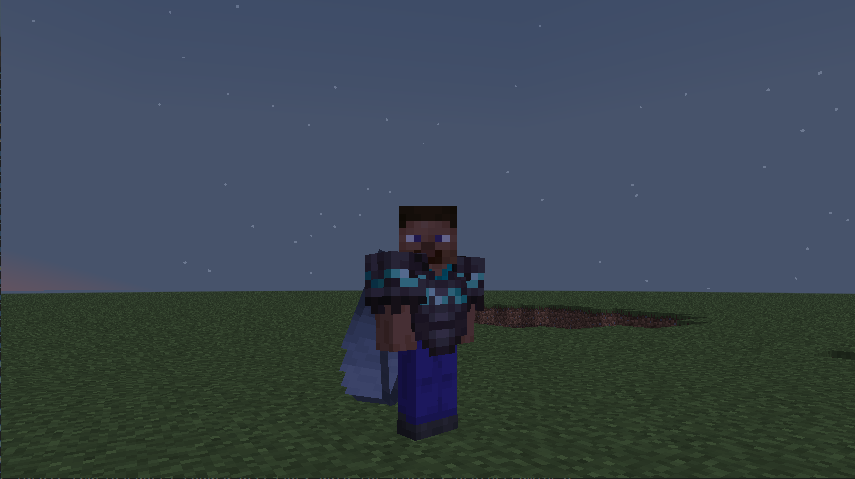

# Features & Debug

This section covers all optional behavior toggles that modify how CuriosPaper interacts with players, accessories, GUIs, and sounds.  
Below that, you’ll find the **Debug** section, which is essential for troubleshooting issues, testing the plugin, or developing addons.

---

## ⚙ Features Config Section

```yaml
features:
  add-slot-lore-to-items: true
  allow-elytra-on-back-slot: true
  show-empty-slots: true
  play-gui-sound: true
  gui-sound: "BLOCK_CHEST_OPEN"
  play-equip-sound: true
  equip-sound: "ENTITY_ITEM_PICKUP"
  play-unequip-sound: true
  unequip-sound: "ENTITY_ITEM_PICKUP"
````

Each option allows you to customize a player-facing feature of CuriosPaper.
Below is a full explanation of each toggle.

---

# ✨ Feature Toggles

## 🏷️ `add-slot-lore-to-items`

```yaml
add-slot-lore-to-items: true
```

When enabled:

* Items tagged as accessories automatically receive a lore line describing which slot they belong to.

Example:

> “§7Accessory Slot: Necklace”

Useful for servers where players frequently trade or inspect accessory items.

### Recommended:

✔ Most servers
❌ Disable only for extremely clean/no-lore item designs

---

## 🪽 `allow-elytra-on-back-slot`

```yaml
allow-elytra-on-back-slot: true
```

When enabled:

* Actual Elytras can be equipped into the **back slot** instead of the chestplate slot.
* CuriosPaper applies correct gliding behavior automatically.
* Elytra durability & damage rules still apply unless overridden by plugins.

This option is essential for RPG-style servers where players want:

* Backpacks
* Capes
* Jetpacks
* Cloaks
* Elytra + Chestplate combos



---

## 🔲 `show-empty-slots`

```yaml
show-empty-slots: true
```

Controls whether **empty slot icons** appear in the GUI.

If disabled:

* Slot-type menus only show *filled* accessory slots.
* Cleaner but less user-friendly.

If enabled:

* All slots are visible even if empty.
* Great for clarity and teaching players how many slots they have.

### Recommended:

✔ Enabled for public servers
❌ Disabled for minimalistic hardcore servers

---

## 🔊 `play-gui-sound`

```yaml
play-gui-sound: true
gui-sound: "BLOCK_CHEST_OPEN"
```

Plays a sound when players open the accessory GUI.

* Immersive feedback
* Helps reinforce input actions
* Can be themed via resource packs

Use any valid **Minecraft sound key**.

---

## 🎵 `play-equip-sound` / `play-unequip-sound`

```yaml
play-equip-sound: true
equip-sound: "ENTITY_ITEM_PICKUP"

play-unequip-sound: true
unequip-sound: "ENTITY_ITEM_PICKUP"
```

Adds subtle audio feedback for:

* Equipping accessories
* Removing accessories
* Swapping accessories

### Tips:

* Change equip sound to `"ENTITY_ARMOR_EQUIP_DIAMOND"` for more dramatic effects
* Use `"BLOCK_NOTE_BLOCK_PLING"` for fantasy-style RPG soundscapes
* Use `"NONE"` (empty string) to disable specific sounds

---

# 🐞 Debug Configuration

Debug settings help diagnose issues with slot handling, API calls, and inventory interactions.
These settings **should NOT be used on production servers** unless resolving an issue.

---

## 🧪 Debug Config Block

```yaml
debug:
  enabled: false
  log-api-calls: false
  log-inventory-events: false
  log-slot-positions: false
```

Each toggle provides visibility into a different part of the plugin’s internal behavior.

---

## 🟡 `enabled`

```yaml
enabled: false
```

Master switch for enabling **ALL** debug logs.

Set to `true` only when:

* Investigating bugs
* Developing addons
* Testing custom slot behaviors
* Debugging resource pack issues

---

## 📜 `log-api-calls`

```yaml
log-api-calls: false
```

Logs every time another plugin uses CuriosPaper’s API:

* Accessory equip/remove
* Slot queries
* Item tagging
* Resource pack injections

Useful for:

* Developers building addons
* Monitoring API misuse
* Finding plugin conflicts

---

## 🧰 `log-inventory-events`

```yaml
log-inventory-events: false
```

Logs:

* Clicks inside CuriosPaper GUIs
* Hotbar swaps
* Drag actions
* Shift-click operations
* Canceled inventory actions

This is extremely useful for diagnosing:

* Why a player cannot equip an item
* Plugin conflicts with inventory listeners
* Duplication protection systems

---

## 📐 `log-slot-positions`

```yaml
log-slot-positions: false
```

Outputs debug information about GUI slot arrangement:

* Pattern application
* Slot-index calculations
* Visual layout mapping

Enable this when:

* Adjusting the GUI patterns
* Debugging strange visual placements
* Testing custom slot counts

---

# ✔ Recommended Debug Settings

### For **normal servers**

```
enabled: false
log-api-calls: false
log-inventory-events: false
log-slot-positions: false
```

### For **plugin developers** working with CuriosPaper

```
enabled: true
log-api-calls: true
log-inventory-events: true
log-slot-positions: false
```

### For **GUI layout testing**

```
enabled: true
log-slot-positions: true
```

### For **bug reports**

Ask players to set:

```
enabled: true
log-api-calls: true
log-inventory-events: true
```

---

# 📌 Summary

| Setting                     | Description                       |
| --------------------------- | --------------------------------- |
| `add-slot-lore-to-items`    | Show accessory slot info on items |
| `show-empty-slots`          | Show or hide empty slots in menus |
| `allow-elytra-on-back-slot` | Enables Elytra in back slot       |
| `play-gui-sound`            | Sound when opening GUI            |
| `play-equip-sound`          | Sound when equipping              |
| `play-unequip-sound`        | Sound when unequipping            |
| `debug.enabled`             | Master debug switch               |
| `log-api-calls`             | Logs external plugin API usage    |
| `log-inventory-events`      | Logs GUI interactions             |
| `log-slot-positions`        | Visual layout debug               |

CuriosPaper includes powerful feature toggles and debugging tools allowing fine-grained control, customization, and visibility — critical for stable public servers and addon developers.

---
