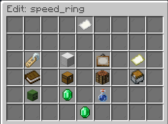
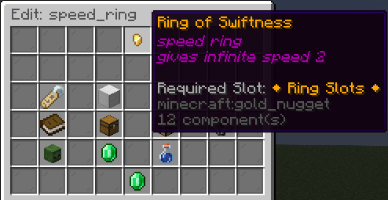
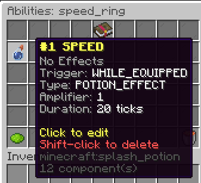
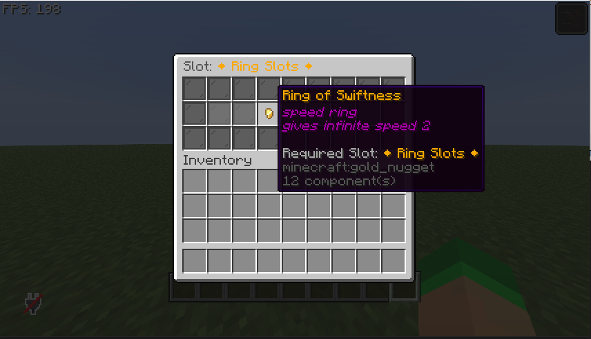

# Your First Accessory

This guide walks you through creating your first custom accessory item using the in-game editor.

## Prerequisites

- CuriosPaper installed and running
- Operator permissions (or `curiospaper.edit` permission)
- The `item-editor` feature enabled in `config.yml` (enabled by default)

## Step 1: Create the Item

Run the following command:

```
/edit create speed_ring
```

This creates a new custom item with the ID `speed_ring` and opens the **Edit GUI**.

<!-- TODO: Add image - In-game screenshot of the Edit GUI with a freshly created item, showing all the clickable property buttons (name, material, slot type, lore, model data, abilities, recipes, mob drops, trades) -->


## Step 2: Configure the Item

In the Edit GUI, you can set:

1. **Display Name** — Click the name tag to set a custom name (e.g., `&6Ring of Swiftness`)
2. **Material** — Click the material slot to change the base item (e.g., `GOLD_NUGGET`)
3. **Slot Type** — Click the slot type button and select `ring`
4. **Lore** — Add description lines
5. **Custom Model Data** — Set an integer for custom textures (optional)

<!-- TODO: Add image - In-game screenshot of the Edit GUI after configuring the item properties, showing the item with its new name, material, and slot type assigned -->


## Step 3: Add an Ability

1. In the Edit GUI, click the **Abilities** button (potion icon)
2. This opens the **Ability Editor**
3. Set the following:
    - **Trigger**: `WHILE_EQUIPPED`
    - **Effect Type**: `POTION_EFFECT`
    - **Effect Name**: `SPEED`
    - **Amplifier**: `0` (Speed I)
    - **Duration**: `100` (5 seconds, refreshes continuously)

<!-- TODO: Add image - In-game screenshot of the Ability Editor GUI showing the speed ability configured with WHILE_EQUIPPED trigger, POTION_EFFECT type, SPEED effect -->


## Step 4: Add a Recipe

1. In the Edit GUI, click the **Recipes** button
2. This opens the **Recipe Editor**
3. Choose **Shaped** recipe type
4. Arrange ingredients in the 3×3 grid:

```
   G G
   G D G
   G G

G = GOLD_INGOT, D = DIAMOND
```

## Step 5: Test It

1. Craft the item using the recipe you defined
2. Open the accessory GUI with `/baubles`
3. Click on the **Ring Slots** category
4. Place your `Ring of Swiftness` into an empty ring slot
5. You should receive the Speed I effect!

<!-- TODO: Add image - In-game screenshot showing the Ring of Swiftness equipped in a ring slot in the Tier 2 GUI, with the Speed I effect icon visible on the player's screen -->


## Step 6: Give the Item

You can also give the item directly:

```
/edit give speed_ring
/edit give speed_ring PlayerName 3
```

!!! success "Congratulations!"
    You've created your first custom accessory with an ability and a recipe. Explore the [Systems](../systems/accessory-system.md) section to learn about all the features available.
