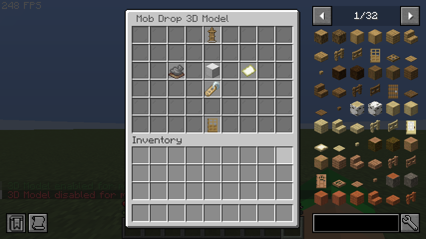

# GUI Editors

CuriosPaper provides in-game visual editors for creating and configuring custom items. These editors are accessible through the `/edit` command.

## Sections

| Page | Description |
|---|---|
| [Ability Editor](ability-editor.md) | Configure potion effects and attribute modifiers |
| [Recipe Editor](recipe-editor.md) | Create shaped, shapeless, furnace, anvil, and smithing recipes |
| [Loot Table Editor](loot-table-editor.md) | Browse, add, edit, and delete loot table entries with a 3-screen editor |
| [Mob Drop Editor](mob-drop-editor.md) | Configure mob drops with entity types and chances |
| [Trade Editor](trade-editor.md) | Set up villager trades with professions and costs |
| [3D Model Editor](3d-model-editor.md) | Configure 3D model rendering attachments for items |
| [Mob Drop Model Editor](#mob-drop-model-editor) | Configure 3D models that mobs wear when spawning with drops |

## Accessing the Editor

```
/edit create <itemId>   — Create a new item and open the editor
/edit gui <itemId>      — Open the editor for an existing item
```

**Permission required:** `curiospaper.edit`

## Main Edit GUI

The main Edit GUI displays the current item configuration with clickable buttons to modify each property:

| Button | Icon | Slot | Function |
|---|---|---|---|
| Name Tag | Name Tag | — | Set display name |
| Material Slot | Current Material | — | Change base material |
| Slot Type | Slot Icon | — | Assign accessory slot |
| Lore | Book | — | Edit description lines |
| Model Data | Map | — | Set custom model data / item model |
| Abilities | Potion | — | Open the Ability Editor |
| Recipes | Crafting Table | — | Open the Recipe Editor |
| Loot Tables | Chest | — | Open the Loot Table Editor |
| Mob Drops | Zombie Head | — | Open the Mob Drop Editor |
| Trades | Emerald | — | Open the Trade Editor |
| 3D Model Settings | Armor Stand | 43 | Open the 3D Model Editor |

!!! info "Chat Input"
    Most editors use a chat-based input system. When prompted, type your value in chat. The `ChatInputManager` handles capturing and processing these inputs.

<!-- TODO: Add image - In-game screenshot of the main Edit GUI showing all property buttons arranged in the inventory with a custom item being edited -->


---

## Mob Drop Model Editor

The Mob Drop Model Editor is a sub-editor accessible from the Mob Drop Editor. It allows configuring 3D models that mobs wear visually when they spawn with a configured drop.

### Accessing

1. Open the item editor: `/edit gui <itemId>`
2. Click the **Mob Drops** button (zombie head icon)
3. Click on an existing mob drop entry
4. Click the **3D Model** button

### Settings

| Button | Slot | Function |
|---|---|---|
| Toggle Model | 20 | Enable/disable the 3D model for this mob drop |
| Model Material | 22 | Set the material of the model item (e.g., `LEATHER_HORSE_ARMOR`) |
| Model Data | 24 | Set CustomModelData integer or clear it |
| Item Model | 31 | Set a 1.21.4+ `itemModel` component (`namespace:key`) |
| Back | 49 | Return to the Mob Drop Editor |

<!-- TODO: Add image - In-game screenshot of the Mob Drop Model Config GUI showing toggle, material, model data, and item model buttons -->

