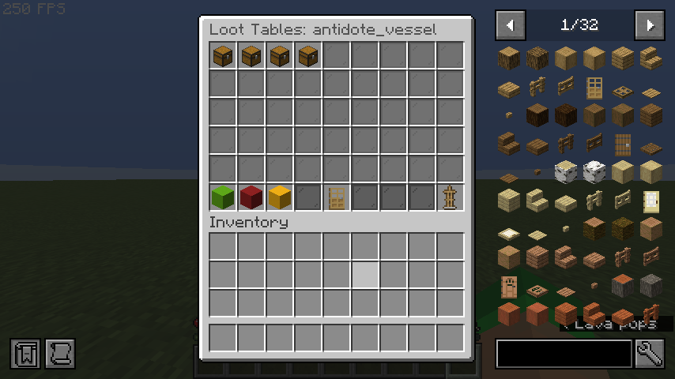
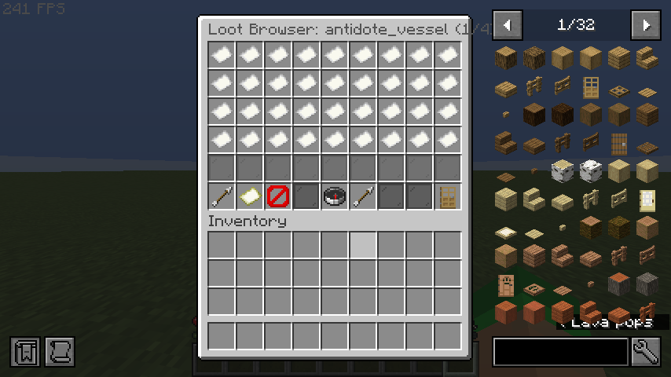
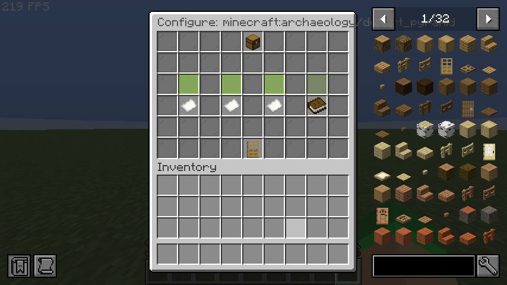

# Loot Table Editor

The Loot Table Editor provides a full 3-screen in-game interface for managing which vanilla loot tables (dungeon chests, mineshafts, temples, etc.) can contain your custom items.

## Accessing

1. Open the item editor: `/edit gui <itemId>`
2. Click the **Loot Tables** button (chest icon)
3. The Loot Table Editor opens

## Screen 1: Main Editor

The main editor lists all existing loot table entries for the current item.

<!-- TODO: Add image - In-game screenshot of the Loot Table Editor main screen showing existing loot entries as chest items with table key, chance, and amount info in the lore -->


### Layout

| Slot | Item | Function |
|---|---|---|
| 0–26 | Chest icons | Existing loot table entries (click to select) |
| 45 | Lime Concrete | **➕ Add** — Opens the Loot Table Browser |
| 46 | Red Concrete | **✖ Delete Selected** — Removes the selected entry |
| 47 | Yellow Concrete | **✎ Edit Selected** — Re-configure the selected entry |
| 49 | Oak Door | **« Back to Editor** — Returns to the item Edit GUI |
| 53 | Armor Stand | **💾 Save** — Saves loot table data to disk |

### Usage

1. **Selecting an entry:** Click on any existing loot entry (chest icon) to select it. A confirmation message appears in chat.
2. **Deleting:** Select an entry first, then click the red Delete button.
3. **Editing:** Select an entry first, then click the yellow Edit button. This opens the Quick Config screen with the same loot table pre-selected.

## Screen 2: Loot Table Browser

A paginated browser showing all registered loot table keys on the server.

<!-- TODO: Add image - In-game screenshot of the Loot Table Browser showing a paginated grid of paper items labeled with loot table keys, with navigation arrows and search buttons at the bottom -->


### Layout

| Slot | Item | Function |
|---|---|---|
| 0–35 | Paper icons | Loot table keys (36 per page) |
| 45 | Arrow | **« Prev Page** |
| 46 | Map | **Search** — Opens chat input for filter text |
| 47 | Barrier | **Clear Filter** — Removes current search filter |
| 49 | Compass | **Refresh Registry** — Reloads the loot table list |
| 50 | Arrow | **Next Page »** |
| 53 | Oak Door | **« Back to Loot Tables** — Returns to the main editor |

### Searching

Click the **Search** button (map icon) to filter loot tables by key or namespace. Type your filter text in chat (e.g., `dungeon`, `buried`, `chests`). Click **Clear Filter** to show all entries again.

### Selecting

Click any loot table key to proceed to the Quick Config screen.

## Screen 3: Quick Config

After selecting a loot table from the browser, the Quick Config screen lets you set the drop chance and amount using presets or custom values.

<!-- TODO: Add image - In-game screenshot of the Quick Config screen showing a header with the selected loot table key, chance presets (10%, 25%, 50%, 100%), amount presets (1-1, 1-3, 2-5), and a custom chat option -->


### Layout

| Slot | Item | Function |
|---|---|---|
| 4 | Chest | Header — shows the selected loot table key |
| 19 | Lime Glass | **Preset 10%** — 10% chance, amount 1 |
| 21 | Lime Glass | **Preset 25%** — 25% chance, amount 1 |
| 23 | Lime Glass | **Preset 50%** — 50% chance, amount 1 |
| 25 | Green Glass | **Preset 100%** — 100% chance, amount 1 |
| 28 | Paper | **Amount 1–1** — Default 10% chance |
| 30 | Paper | **Amount 1–3** — Default 10% chance |
| 32 | Paper | **Amount 2–5** — Default 10% chance |
| 34 | Book | **Custom (chat)** — Enter exact values via chat |
| 49 | Oak Door | **« Back to Browser** |

### Custom Values

Click **Custom (chat)** to enter precise values. In chat, type the chance followed by the amount range, separated by a space:

```
0.15 1-3
```

This sets a 15% chance with a drop amount of 1 to 3.

### After Configuration

After selecting a preset or entering custom values:

1. The loot entry is added to the item
2. Data is saved to disk automatically
3. You are returned to the main Loot Table Editor screen
4. The new entry now appears in the list

## Workflow Example

**Goal:** Make a `lucky_ring` appear in dungeon chests with a 25% chance.

1. Run `/edit gui lucky_ring`
2. Click the **Loot Tables** button (chest icon)
3. Click **➕ Add**
4. In the Browser, click **Search** and type `dungeon`
5. Click `minecraft:chests/simple_dungeon`
6. Click **Preset 25%**
7. Done! The entry is saved automatically.

## Validation

- Chance is clamped between 0.0 and 1.0
- Minimum amount is at least 1
- Maximum amount is always ≥ minimum amount
- Loot table keys must be valid namespaced keys or known `LootTables` enum values
