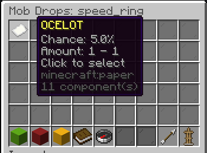

# Mob Drop Editor

The Mob Drop Editor allows you to configure which mobs drop your custom items.

## Accessing

1. Open the item editor: `/edit gui <itemId>`
2. Click the **Mob Drops** button (zombie head icon)
3. The Mob Drop Editor GUI opens

## Interface

Each configured mob drop is displayed as an item showing:

- **Entity type** (e.g., ZOMBIE, SKELETON)
- **Drop chance** (0%–100%)
- **Amount range** (min–max)

<!-- TODO: Add image - In-game screenshot of the Mob Drop Editor GUI showing configured mob drops as items with entity type, chance, and amount info in the lore -->

## Adding a Mob Drop

1. Click **Add Mob Drop**
2. Set each property via chat:
    - **Entity Type**: Type the entity name (e.g., `ZOMBIE`)
    - **Chance**: Type a decimal (e.g., `0.05` for 5%)
    - **Min Amount**: Minimum items to drop
    - **Max Amount**: Maximum items to drop

## Editing a Mob Drop

1. Click on an existing mob drop
2. Select the property to modify
3. Enter the new value in chat

## Removing a Mob Drop

1. Click on an existing mob drop
2. Select **Remove**

## Validation

- Entity type must be a valid living entity
- Chance must be between 0.0 and 1.0
- Min amount must be at least 1
- Max amount must be ≥ min amount
