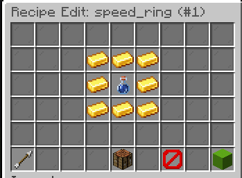

# Recipe Editor

The Recipe Editor provides an in-game interface for creating crafting recipes for custom items.

## Accessing

1. Open the item editor: `/edit gui <itemId>`
2. Click the **Recipes** button (crafting table icon)
3. The Recipe Editor GUI opens

## Supported Recipe Types

| Type | Description |
|---|---|
| Shaped | 3×3 grid with defined pattern |
| Shapeless | Any ingredient arrangement |
| Furnace | Smelting recipe |
| Anvil | Combining two items |
| Smithing | Smithing table upgrade |

## Creating a Shaped Recipe

1. Click **Add Recipe** → **Shaped**
2. A 3×3 crafting grid appears in the GUI
3. Place items into the grid slots to define the pattern
4. The result (your custom item) is shown in the output slot
5. Click **Save** to register the recipe

<!-- TODO: Add image - In-game screenshot of the Recipe Editor showing the 3x3 shaped crafting grid with items placed in a pattern and the result item shown -->

## Creating a Shapeless Recipe

1. Click **Add Recipe** → **Shapeless**
2. Place items into the ingredient slots (any order)
3. Click **Save** to register

## Creating a Furnace Recipe

1. Click **Add Recipe** → **Furnace**
2. Set the input item via the GUI or chat
3. Configure cooking time (ticks) and experience via chat
4. Click **Save**

## Creating an Anvil Recipe

1. Click **Add Recipe** → **Anvil**
2. Set the left and right input items
3. Click **Save**

## Creating a Smithing Recipe

1. Click **Add Recipe** → **Smithing**
2. Set the base item, addition item, and template item
3. Click **Save**

## Managing Recipes

- **Edit**: Click on an existing recipe to modify it
- **Delete**: Click the delete button next to a recipe
- **Multiple recipes**: Items can have multiple recipes of different types

## Custom Item Ingredients

You can use other CuriosPaper custom items as recipe ingredients. They are identified by their item ID and PDC tag.
