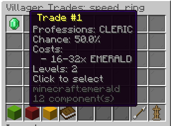

# Trade Editor

The Trade Editor allows you to configure villager trades for your custom items.

## Accessing

1. Open the item editor: `/edit gui <itemId>`
2. Click the **Trades** button (emerald icon)
3. The Trade Editor GUI opens

## Interface

Each configured trade is displayed showing:

- **Professions** that offer the trade
- **Trade chance** (0%–100%)
- **Required levels**
- **Cost items** with amounts

<!-- TODO: Add image - In-game screenshot of the Trade Editor GUI showing configured trades with profession, chance, and cost info in the lore -->

## Adding a Trade

1. Click **Add Trade**
2. Set each property via chat:
    - **Professions**: Type profession names (e.g., `CLERIC, LIBRARIAN`) or `ALL`
    - **Chance**: Type a decimal (e.g., `0.3` for 30%)
    - **Trade Levels**: Type levels (e.g., `3, 4, 5`)
    - **Cost Items**: Set material and amount ranges for each cost

## Cost Items

Each trade can have up to 2 cost items:

| Slot | Required | Description |
|---|---|---|
| **Primary** | ✅ | Main cost (usually emeralds) |
| **Secondary** | ❌ | Additional cost (optional) |

For each cost item, configure:

- **Material** (e.g., `EMERALD`)
- **Min amount** and **Max amount**

The actual cost is randomized within the range for each villager instance.

## Editing a Trade

1. Click on an existing trade
2. Select the property to modify
3. Enter the new value in chat

## Removing a Trade

1. Click on an existing trade
2. Select **Remove**

## Validation

- At least one profession must be specified
- Chance must be between 0.0 and 1.0
- At least one cost item is required
- Cost amounts must be positive
