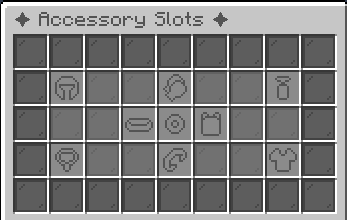
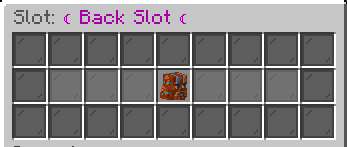

# CuriosPaper

**Custom Accessory Inventory System for Spigot & Paper Servers**

<!-- TODO: Add image - Hero banner showing the CuriosPaper logo with the plugin name and tagline, dark themed, 1200x400px -->
<figure markdown="span" align="center">
  
</figure>
---

CuriosPaper adds a fully configurable accessory slot system to your Minecraft server. Players can equip rings, necklaces, capes, belts, and more through an intuitive GUI — all powered by a flexible API that other plugins can hook into.

<!-- TODO: Add image - In-game screenshot showing the main accessory GUI (Tier 1) open with all 9 slot type icons visible -->
<figure markdown="span" align="center">
  
  <figcaption>Screenshot of the main accessory GUI with all 9 slot type icons</figcaption>
</figure>

## ✨ Key Features

| Feature | Description |
|---|---|
| **9 Default Slot Types** | Head, Necklace, Back, Body, Belt, Hands, Bracelet, Ring, Charm |
| **In-Game Item Editor** | Create and configure custom items without editing YAML files |
| **Ability System** | Attach potion effects and attribute modifiers to accessories |
| **Recipe System** | Shaped, shapeless, furnace, blast furnace, smoker, anvil, and smithing table recipes |
| **Mob Drops** | Configure custom items to drop from any mob with configurable chances |
| **Villager Trades** | Add custom accessories to villager trade pools |
| **Resource Pack Hosting** | Built-in HTTP server auto-generates and serves resource packs |
| **Elytra Back Slot** | Equip elytra in the back accessory slot (1.21.3+) |
| **Paginated Item Browser** | Manage all custom items and their recipes in a visual list |
| **Developer API** | Full API for other plugins to create and manage accessories |
| **Version Support** | Compatible with Spigot/Paper 1.14.4 through latest |

<!-- TODO: Add image - Side-by-side comparison showing the main GUI on the left and the slot inventory (Tier 2) on the right -->
<figure markdown="span" align="center">
  
  <figcaption>Screenshot of the tier 2 inventory</figcaption>
</figure>

## 🚀 Quick Start

1. **[Install the plugin](installation/install.md)** — Drop the JAR into your `plugins/` folder
2. **[Configure your slots](configuration/slots.md)** — Customize the 9 default accessory slots
3. **[Create your first accessory](getting-started/first-accessory.md)** — Use the in-game editor to make items
4. **[Set up the resource pack](installation/resource-pack.md)** — Enable custom textures for slot icons

## 📖 Documentation Sections

- **[Installation](installation/index.md)**  
  Requirements, setup, and first-start guide

- **[Getting Started](getting-started/index.md)**  
  Core concepts, first accessory, and GUI overview

- **[Commands](commands/index.md)**  
  All commands and permissions

- **[Configuration](configuration/index.md)**  
  Slots, abilities, performance tuning

- **[Systems](systems/accessory-system.md)**  
  Deep dives into each plugin system

- **[Resource Pack](resource-pack/index.md)**  
  Hosting, custom models, and troubleshooting

- **[GUI Editors](gui-editors/index.md)**  
  In-game visual editors for items, recipes, and more

- **[Developer API](api/index.md)**  
  Integrate CuriosPaper into your own plugins

- **[Architecture](architecture/overview.md)**  
  Internal design and code structure

- **[Examples](examples/accessory-example.md)**  
  Ready-to-use configuration examples

- **[Troubleshooting](troubleshooting/index.md)**  
  Common issues and their solutions

## 📊 Plugin Info

| | |
|---|---|
| **Version** | 1.3.2 |
| **Author** | Brothergaming52 |
| **API Version** | 1.14-1.21.11 |
| **Source** | [GitHub](https://github.com/Brothergaming52/CuriosPaper) |
| **bStats** | [Plugin Statistics](https://bstats.org/plugin/bukkit/CuriosPaper/29508) |
