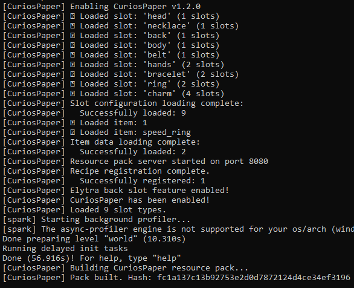

# First Start

After installing CuriosPaper and starting your server, here's what happens and what to expect.

## Startup Sequence

When the server starts with CuriosPaper for the first time, the plugin will:

1. **Generate `config.yml`** with 9 default accessory slot types
2. **Create the `items/` directory** for custom item definitions
3. **Create the `playerdata/` directory** for per-player accessory storage
4. **Initialize the resource pack manager** and extract default assets
5. **Register commands** (`/baubles`, `/curios`, `/edit`)
6. **Start bStats metrics** (anonymous usage statistics, plugin ID: 29508)

## Console Output

A successful first start will show:

```
[CuriosPaper] CuriosPaper has been enabled!
[CuriosPaper] Loaded 9 slot types.
```

<!-- TODO: Add image - Screenshot of the server console showing CuriosPaper's successful startup messages -->


If the elytra back slot feature is enabled and supported:

```
[CuriosPaper] Elytra back slot feature enabled!
```

## Default Slot Types

CuriosPaper ships with 9 pre-configured accessory slots:

| Slot | Icon | Slots | Description |
|---|---|---|---|
| Head | Golden Helmet | 1 | Crowns, circlets, headpieces |
| Necklace | Nautilus Shell | 1 | Amulets and pendants |
| Back | Elytra | 1 | Capes and cloaks |
| Body | Diamond Chestplate | 1 | Chest accessories |
| Belt | Leather | 1 | Utility belts and sashes |
| Hands | Leather Chestplate | 2 | Gloves (both hands) |
| Bracelet | Chain | 2 | Bracelets and bangles |
| Ring | Gold Nugget | 2 | Magical rings |
| Charm | Emerald | 4 | Trinkets and charms |

**Total: 15 accessory slots per player**

## Testing the Plugin

1. Join the server as a player
2. Type `/baubles` (or `/b`) to open the accessory GUI
3. You should see a double-chest GUI with the 9 slot categories

!!! tip "Next Steps"
    Head to [Getting Started → Core Concepts](../getting-started/concepts.md) to learn how the slot system works, or jump to [Your First Accessory](../getting-started/first-accessory.md) to create a custom item.
