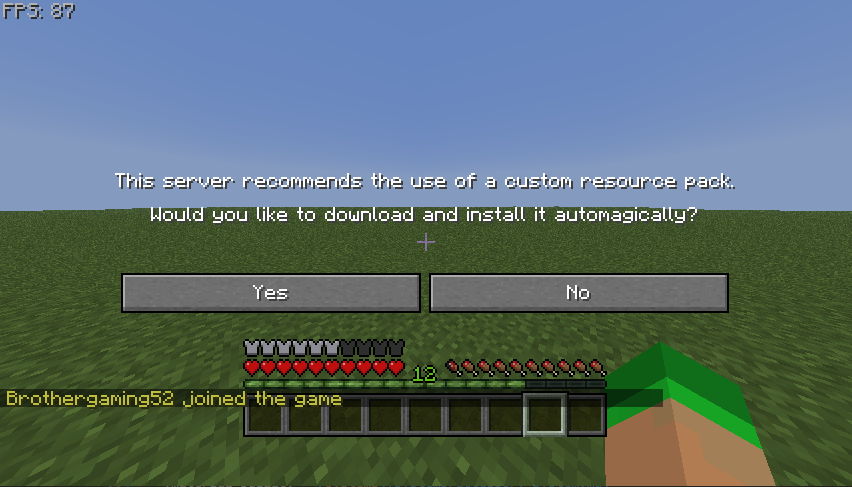

# Resource Pack Hosting

CuriosPaper uses an embedded **Netty-based HTTP server** to host and serve the generated resource pack to players.

<!-- TODO: Add image - In-game screenshot showing the resource pack download prompt that appears when a player joins the server -->


## Configuration

```yaml
resource-pack:
  # Hosting mode: SELF, LINK, or NONE
  mode: "SELF"
  # External link (used only if mode is LINK)
  url: "https://example.com/your-resource-pack.zip"
  # Port for the embedded HTTP server (used only if mode is SELF)
  port: 8080
  # Public IP or Hostname of the server (used only if mode is SELF)
  host-ip: "your-server-ip"
```

## Hosting Modes

CuriosPaper supports three modes for delivering the generated resource pack to clients:

- **`SELF` (Default):** Runs an embedded Netty HTTP server on the configured `port` and `host-ip`. The pack is served directly from the Minecraft server at `http://<host-ip>:<port>/pack.zip`.
- **`LINK`:** Serves the resource pack from a third-party host (e.g. Dropbox, Google Drive direct download, or your web server) defined in the `url` property.
- **`NONE`:** Disables all automated resource pack hosting and prompts. Players will not be prompted to download a resource pack.

## Cache-Busting

Minecraft clients cache resource packs aggressively by URL. To ensure players always download the latest version when custom items are added or modified, CuriosPaper uses query-parameter cache-busting:
- On player join or during `/curios rp rebuild`, the server calculates the SHA-1 hash of the generated ZIP.
- The URL sent to the client is automatically appended with a version parameter containing the hash, e.g., `http://localhost:8080/pack.zip?v=d06a4b12...` or `https://example.com/pack.zip?v=d06a4b12...`.
- This forces the client to download the updated resource pack instead of using its outdated local cache.

## How the Server Works

1. On startup, the `ResourcePackManager` generates a ZIP file from all registered asset sources
2. A SHA-1 hash is calculated for the ZIP
3. A lightweight HTTP server starts on the configured port (if mode is `SELF`)
4. When players join, they receive the resource pack URL (with cache-busting hash query parameter appended)
5. The Minecraft client downloads and applies the pack

## Port Configuration

| Scenario | Recommended Port |
|---|---|
| Dedicated server | `8080` or any open port |
| Shared hosting | Check available ports with your host |
| Local testing | `8080` |

!!! caution "Never use the game port"
    The resource pack port **must** be different from your Minecraft server port (default: 25565). Using the same port will break both services.

## Firewall Rules

Ensure the resource pack port is accessible:

=== "Linux (UFW)"

    ```bash
    sudo ufw allow 8080/tcp
    ```

=== "Linux (iptables)"

    ```bash
    sudo iptables -A INPUT -p tcp --dport 8080 -j ACCEPT
    ```

=== "Windows"

    ```powershell
    netsh advfirewall firewall add rule name="CuriosPaper RP" dir=in action=allow protocol=tcp localport=8080
    ```

## Server Info

View the current resource pack server status:

```
/curios rp info
```

This shows:

- Pack file path and size
- SHA-1 hash
- Number of registered namespaces
- Conflict count

## Registering External Assets

Other plugins can add their assets to the generated resource pack:

```java
CuriosPaperAPI api = CuriosPaper.getInstance().getCuriosPaperAPI();
api.registerResourcePackAssets(myPlugin, new File(getDataFolder(), "resourcepack"));
```

The folder should contain the standard `assets/` directory structure:

```
resourcepack/
└── assets/
    └── myplugin/
        ├── models/
        │   └── item/
        │       └── my_item.json
        └── textures/
            └── item/
                └── my_item.png
```

## Rebuilding

After adding new textures or modifying assets:

```
/curios rp rebuild
```

This regenerates the ZIP, recalculates the hash, and pushes the new pack to all online players.
