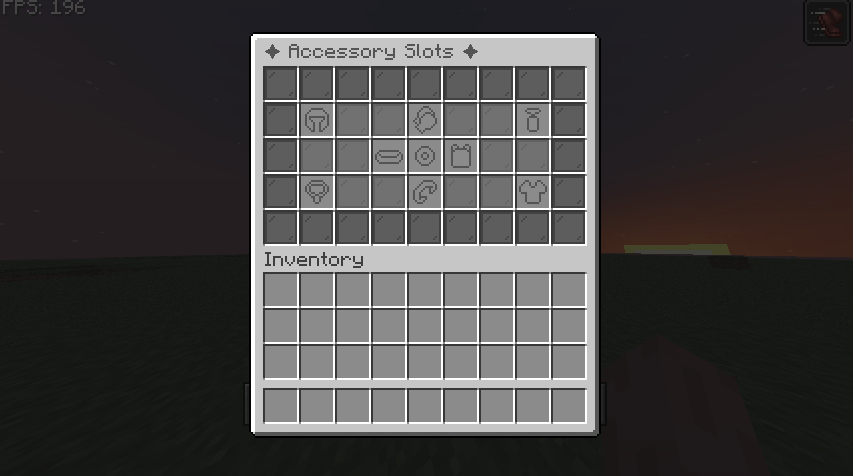

---

# Slots & GUI

CuriosPaper adds a fully customizable **accessory slot system** and an elegant **GUI-based menu** for viewing and managing accessories.  
This page explains how slot types work, how the GUI is structured, and how to configure names, icons, counts, and item models.

If you want a deeper look at the GUI system (patterns, filler items, borders), scroll to the **GUI Layout** section below.


---

## 🔮 What Are Slot Types?

A **slot type** represents a category of accessories — such as head, necklace, back, rings, charms, etc.

Each slot type has:

- A **name** (text shown in the GUI)
- An **icon** (the item used to represent this slot in the menu)
- An **item-model** (the resource pack model ID)
- An **amount** (how many individual accessory slots it contains)
- Optional **lore** (shown on the icon and used by tooltip systems)

Example:  
`ring` has amount `2`, so players have **two ring slots** available.

All slot types are defined under the `slots:` section:

```yaml
slots:
  ring:
    name: "&6◆ Ring Slots ◆"
    icon: "GOLD_NUGGET"
    item-model: "curiospaper:ring_slot"
    amount: 2
    lore:
      - "&7Holds powerful magical rings."
```

CuriosPaper ships with **9 default slot types**, but you can freely edit, rename, or repurpose them.

---

## 🧩 Slot Configuration Breakdown

Here is a breakdown of every key inside each slot type:

### **name**

The display name shown inside the GUI.

```yaml
name: "&e⚜ Head Slot ⚜"
```

Color codes (`&e`, `&b`, etc.) are supported.

---

### **icon**

The item used as the clickable button for that slot category in the main GUI.

```yaml
icon: "GOLDEN_HELMET"
```

Icons should be regular materials (not custom model data).

---

### **item-model**

This is the **NamespacedKey** of the model used in the resource pack.
CuriosPaper automatically injects these models when building the pack.

```yaml
item-model: "curiospaper:head_slot"
```

Your resource pack will contain a file like:

```
assets/curiospaper/models/item/head_slot.json
```

If you change this, make sure you have a matching file in your resource pack or plugin assets.

---

### **amount**

How many individual accessory slots exist for that slot type.

Examples:

* `amount: 1` → one necklace slot
* `amount: 2` → two hand/glove slots
* `amount: 4` → multiple charm/trinket slots

```yaml
amount: 4
```

These are shown in the GUI as separate slots inside the slot-type submenu.

---

### **lore**

Description lines displayed on the slot icon.

```yaml
lore:
  - "&7Equip magical capes and cloaks."
  - "&7Provides mobility and defense."
```

Optional, but helpful for players.

---

## 🗂️ Default Slot Types Included

CuriosPaper ships with:

| Slot Type    | Default Amount | Icon               | Icon (Resource Pack enabled) |
| ------------ | -------------- | ------------------ |------------------------------|
| **head**     | 1              | GOLDEN_HELMET      | Paper                        |
| **necklace** | 1              | NAUTILUS_SHELL     | Paper                        |
| **back**     | 1              | ELYTRA             | Paper                        |
| **body**     | 1              | DIAMOND_CHESTPLATE | Paper                        |
| **belt**     | 1              | LEATHER            | Paper                        |
| **hands**    | 2              | LEATHER_CHESTPLATE | Paper                        |
| **bracelet** | 2              | CHAIN              | Paper                        |
| **ring**     | 2              | GOLD_NUGGET        | Paper                        |
| **charm**    | 4              | EMERALD            | Paper                        |

You can modify, rename, or restructure any of them.

---

## 🎛️ GUI Layout

The GUI is split into two tiers:

### **Tier 1 — Main Menu**

Opened with `/baubles`, `/b`, or `/bbag`.

Shows **each slot type** as a clickable icon.

Controlled by:

```yaml
gui:
  main-title: "&8✦ Accessory Slots ✦"
  filler-material: "GRAY_STAINED_GLASS_PANE"
  border-material: "BLACK_STAINED_GLASS_PANE"
  filler-name: "&r"
  main-gui-size: 54
  use-patterns: true
```

* `main-gui-size` is fixed at 54 (double chest GUI).
* `use-patterns` applies decorative arrangements around the icons.

---

### **Tier 2 — Slot-Type Menu**

When a player clicks a slot group (e.g. rings), they enter the slot-type GUI:

* The title is `"slot-title-prefix" + slotName`
* The number of slots = `amount` from the slot config
* Each slot is represented by an empty slot icon, unless filled with an accessory

Config:

```yaml
slot-title-prefix: "&8Slots: "
```

Example:

```
&8Slots: Ring Slots
```

---

## 🛠️ Example: Creating More Charm Slots

To increase charm slots from 4 to 8:

```yaml
charm:
  name: "&d✧ Charm Slots ✧"
  icon: "EMERALD"
  item-model: "curiospaper:charm_slot"
  amount: 8
  lore:
    - "&7Holds small, potent charms and trinkets."
```

This will:

* Double the number of charm slot icons in the charm menu
* Not require any code changes
* Automatically update GUI patterns

---

## 🖼️ Example: Changing Icons

To make ring slots look more “magical”, change the icon:

```yaml
ring:
  icon: "AMETHYST_SHARD"
```

This immediately updates:

* Main GUI icon
* Tooltip
* Theme feel

---

## 🪄 Example: Renaming Slots

If you want a more RPG-style naming scheme:

```yaml
belt:
  name: "&6⚔ Utility Gear ⚔"
```

Renames it everywhere in the GUI.

---

## 🎨 Example: Custom Slot Model

If you have your own resource pack model:

1. Add file:
   `assets/myplugin/models/item/my_ring_model.json`

2. Use it in config:

```yaml
item-model: "myplugin:my_ring_model"
```

CuriosPaper will:

* Inject this into the merged resource pack
* Use it for your ring icon automatically
---
