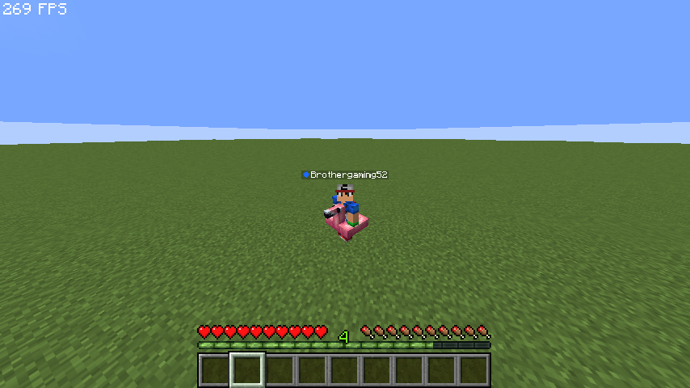
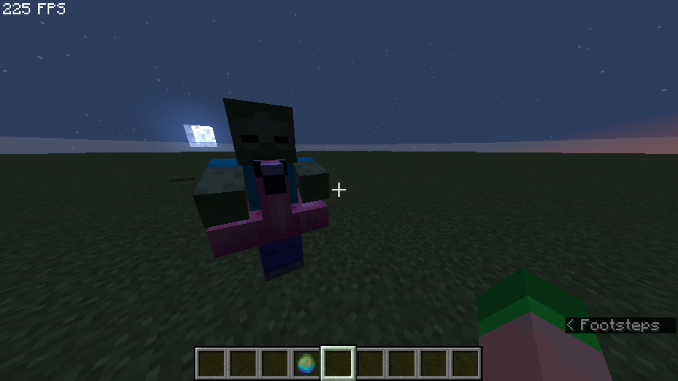

# 3D Model System

The 3D Model System allows you to attach custom 3D models directly to the player's body when they equip specific Curios items. Models are rendered using synchronized invisible Armor Stands.

## How It Works

Rather than only showing custom items in the hand or inventory, CuriosPaper uses synchronized Armor Stands to render custom models on the player's body.

```
┌──────────────────┐     ┌──────────────┐     ┌─────────────────┐
│ Player Equips    │────▶│ Model Stand  │────▶│ Renders Model   │
│ Curios Item      │     │ Manager      │     │ on Player       │
└──────────────────┘     └──────────────┘     └─────────────────┘
                                │
                                ▼
                         ┌──────────────┐
                         │ Rotation &   │
                         │ Visibility   │
                         │ Sync (Tick)  │
                         └──────────────┘
```

### Entity Architecture

When an item with a 3D model configuration is placed in an accessory slot, CuriosPaper dynamically spawns an invisible marker Armor Stand that rides the player as a passenger.

- The armor stand wears the defined model item (e.g., `LEATHER_HORSE_ARMOR` combined with a specific `itemModel` component in 1.21.4+, or `CustomModelData` in older versions).
- The stand tracks the player's rotation seamlessly via a tick task.
- For items in a `head:` slot, the armor stand head strictly synchronizes to the player's independent head yaw left-to-right (maintaining a 0-pitch angle for perfect horizontal alignment). Other slots lock into both full body yaw and overall pitch.
- When the accessory is unequipped or the player logs out, the stand is safely destroyed.

## Visibility Culling

To prevent the armor stand from obscuring the player's vision when in first-person view, CuriosPaper implements a dynamic visibility culling system.

### Pitch Limits

You can configure downward and upward pitch cutoffs per item. When the player looks too far down (or up), the model is hidden from their own view. Instead of unequipping the item (which would hide it from everyone), CuriosPaper leverages reflection to call the server-side entity hiding packet API (`hideEntity(...)`) to hide the passenger armor stand strictly from the wearer's view. It remains completely visible to other nearby players.

| Limit | Description |
|---|---|
| **Pitch Up Limit** | Hide model when the player looks up beyond this angle (e.g., `45.0°`) |
| **Pitch Down Limit** | Hide model when the player looks down beyond this angle (e.g., `30.0°`) |

### Per-Item Toggles

Players have control over whether their equipped models are visible:

- By **Right-Clicking** an equipped accessory in the `/baubles` menu, players can toggle its global 3D model visibility.
- This preference is saved directly to the item's PersistentDataContainer (`curios_model_hidden`), meaning it persists even if the item is dropped or traded.

## Player State Handling

The `ModelStandManager` handles complex player states:

| Player State | Behavior |
|---|---|
| **Walking/Running** | Models follow player position and rotation |
| **Sneaking** | Models update position to match sneaking offset |
| **Swimming** | Models are repositioned for swimming pose |
| **Gliding (Elytra)** | Models are repositioned for gliding pose |
| **Teleporting** | Models are force-updated to new position |
| **World Change** | Models are removed and re-scanned in the new world |
| **Death** | All models removed; re-scanned on respawn |
| **Disconnect** | All models cleaned up |
| **Game Mode Change** | Models updated (hidden in spectator, etc.) |

## Trident Compatibility

When a player uses a trident, the 3D models are temporarily removed to prevent visual glitches:

- **Normal Throw:** Models are removed when the player starts charging, restored when they release or after a timeout.
- **Riptide:** Models are removed on riptide activation, restored when the player lands on the ground.

## RTP Compatibility

When a player teleports, especially asynchronously or via Random Teleport (RTP) plugins or portal transitions, passenger entities (the invisible armor stands) can desynchronize, glitch, or become "ghost" entities.

To solve this, CuriosPaper features an RTP dismount mechanism:
- **Temporary Dismount:** When a registered RTP event is triggered, the model stands are safely dismounted from the player.
- **Automatic Remount:** As soon as the player begins moving at their destination (tracked by movement exceeding a `0.05` block threshold), the stands are instantly and cleanly remounted.
- **Recording Sequences:** Admins can record custom trigger interactions (commands, stepped-on blocks, clicked blocks, entity/NPC clicks, or GUI clicks) using the in-game `/curios recordrtp` command. These are saved under the `features.rtp` block in `config.yml`.

## Scale Synchronization

If the player is scaled via external plugins (e.g., shrink/enlarge effects), the armor stand model automatically scales to match the player's size. A periodic sync task checks for scale changes every second.

## Model Protection

Model armor stands are fully protected from the game world:

- Cannot take damage from any source
- Cannot be targeted by mobs
- Cannot be interacted with (no right-click trade GUI, etc.)
- Cannot be pushed by other entities

## Configuring Models

Models can be configured in three ways:

### 1. In-Game GUI

Using the [3D Model Editor](../gui-editors/3d-model-editor.md) via `/edit gui <item>` → click the Armor Stand button (slot 43).

### 2. API

```java
CuriosPaperAPI api = CuriosPaper.getInstance().getCuriosPaperAPI();

// Configure 3D model for an item
api.setItemModelConfig(
    "my_cape",           // item ID
    true,                // model enabled
    "LEATHER_HORSE_ARMOR", // model material
    null,                // CustomModelData (null if using item model)
    "myplugin:cape_model", // item model component (1.21.4+)
    45.0f,               // pitch up limit (hide when looking up >45°)
    30.0f                // pitch down limit (hide when looking down >30°)
);
```

### 3. Item YAML

```yaml
# plugins/CuriosPaper/items/my_cape.yml
item-id: my_cape
display-name: "&5Royal Cape"
material: PAPER
slot-type: back

# 3D Model Settings
model-enabled: true
model-item: "LEATHER_HORSE_ARMOR"
model-custom-model-data: null
model-item-model: "myplugin:cape_model"
pitch-up-limit: 45.0
pitch-down-limit: 30.0
```

## Mob Drop Models

Mobs can also display 3D models when they spawn carrying a custom item. This is configured separately per mob drop entry.

### In-Game GUI

Use the [Mob Drop Editor](../gui-editors/mob-drop-editor.md) → click an existing mob drop → 3D Model button.

### API

```java
// Configure 3D model for a mob drop
api.setMobDropModelConfig(
    "my_crown",          // item ID
    "ZOMBIE",            // entity type
    true,                // model enabled
    "GOLDEN_HELMET",     // model material
    null,                // CustomModelData
    "myplugin:crown_model" // item model component
);
```

<!-- TODO: Add image - In-game screenshot showing a player wearing a 3D model accessory (e.g., a cape or crown visible on their body) alongside other players who can see the model -->


<!-- TODO: Add image - In-game screenshot showing a zombie spawned with a 3D model helmet visible on its head from a mob drop configuration -->

